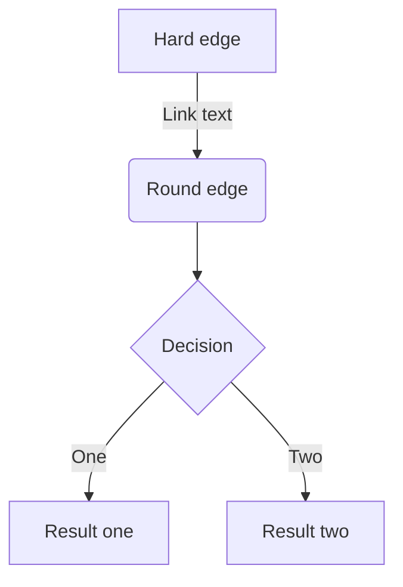

# url preview

https://www.oreilly.co.jp/books/9784873119694

https://www.c-r.com/book/detail/1462

https://asciidwango.jp/post/176293765750/clean-architecture

https://www.shuwasystem.co.jp/book/9784798046143.html

https://www.seshop.com/product/detail/25970

https://www.lambdanote.com/products/cpu

https://gihyo.jp/book/2014/978-4-7741-6753-4

https://www.borndigital.co.jp/book/19115/

https://www.sbcr.jp/product/4815609795/

https://book.mynavi.jp/ec/products/detail/id=22065

https://store-jp.nintendo.com/list/goods/book-music-poster/NSJ_8_B9AAA.html

https://www.kadokawa.co.jp/product/301508001220/

https://book.impress.co.jp/books/1115101145

https://bookplus.nikkei.com/atcl/catalog/03/579100/

https://www.kohgakusha.co.jp/books/detail/978-4-7775-2239-2

https://www.kadokawa.co.jp/product/200600003156/

https://www.amazon.co.jp/dp/4756136591

https://books.rakuten.co.jp/rb/16094948/?l-id=item-r-rank-05

https://store.shopping.yahoo.co.jp/jiasp5/20221218003459-00424us.html

https://www.kinokuniya.co.jp/f/dsg-01-9784756136596

https://booklog.jp/item/1/4274067939

https://honto.jp/netstore/pd-book_01955162.html

https://jp.mercari.com/shops/product/cp6TKKsPueMeXCLDfN675F

https://bookmeter.com/books/148192

https://www.hanmoto.com/bd/isbn/9784910508016

https://item.rakuten.co.jp/gorilla55/tx-701

https://ja.wikipedia.org/wiki/UNIX%E5%93%B2%E5%AD%A6

このページでは Zenn のmarkdown記法を一覧で紹介します。

# 見出し

```
# 見出し1
## 見出し2
### 見出し3
#### 見出し4
```

# 見出し1
## 見出し2
### 見出し3
#### 見出し4

# リスト

```
- Hello!
- Hola!
  - Bonjour!
  * Hi!
```

- Hello!
- Hola!
  - Bonjour!
  - Hi!

## 番号付きリスト

```
1. First
2. Second
```

1. First
2. Second

# テキストリンク

```
[アンカーテキスト](リンクのURL)
```

[アンカーテキスト](https://zenn.dev)

# 画像

```

```


## 画像の横幅を指定する

画像の表示が大きすぎる場合は、URL の後に半角スペースを空けて`=○○x`と記述すると、画像の幅を px 単位で指定できます。

```

```


## キャプションをつける

画像のすぐ下の行に`*`で挟んだテキストを配置すると、キャプションのような見た目で表示されます。

```

*キャプション*
```


_captions_

# テーブル

```
| Head | Head | Head |
| ---- | ---- | ---- |
| Text | Text | Text |
| Text | Text | Text |
```

| Head | Head | Head |
| ---- | ---- | ---- |
| Text | Text | Text |
| Text | Text | Text |

# コードブロック

コードは「```」で挟むことでブロックとして挿入できます。以下のように言語を指定するとコードへ装飾（シンタックスハイライト）が適用されます。

```javascript title="foo.js"
const foo = () => {
    console.log("foo");
};
```

```javascript title="foo.js" mark={5} ins={8} "テキスト"
const foo = () => {
    // コード中の「テキスト」という文字列を強調
    console.log("テキスト");
    console.log("テキスト");
    // この行だけ強調
};
```

```bash
bash
```

## diff のシンタックスハイライト

```diff js
@@ -4,6 +4,5 @@
+    const foo = bar.baz([1, 2, 3]) + 1;
-    let foo = bar.baz([1, 2, 3]);
```

# 数式

Zenn では**KaTeX**による数式表示に対応しています。
KaTeXのバージョンは常に最新バージョンを使用します。

[📄 KaTeXがサポートする記法の一覧 →](https://katex.org/docs/support_table.html)

## 数式のブロックを挿入する

`$$`で記述を挟むことで、数式のブロックが挿入されます。たとえば

```
$$
e^{i\theta} = \cos\theta + i\sin\theta
$$
```

は以下のように表示されます。

$$
e^{i\theta} = \cos\theta + i\sin\theta
$$

## インラインで数式を挿入する

`$a\ne0$`というように`$`ひとつで挟むことで、インラインで数式を含めることができます。たとえば$a\ne0$のようなイメージです。

# 引用

```
> 引用文
> 引用文
```

> 引用文
> 引用文

# 注釈

注釈を指定するとページ下部にその内容が表示されます。

```
脚注の例[^1]です。

[^1]: 脚注の内容その1
```

脚注の例[^1]です。

[^1]: 脚注の内容その 1

# 区切り線

```
-----
```

---

# インラインスタイル

```
*イタリック*
**太字**
~~打ち消し線~~
インラインで`code`を挿入する
```

_イタリック_
**太字**
~~打ち消し線~~
インラインで`code`を挿入する

## インラインのコメント

自分用のメモをしたいときは HTML のコメント記法を使用できます。

```html
<!-- TODO: ◯◯について追記する -->
```

<!-- コメントテスト -->

この形式で書いたコメントは公開されたページ上では表示されません。ただし、複数行のコメントには対応していないのでご注意ください。

# タスクリスト

- [x] #739
- [ ] https://github.com/octo-org/octo-repo/issues/740
- [ ] Add delight to the experience when all tasks are complete :tada:

# アラート

> [!NOTE/ノート]
> Useful information that users should know, even when skimming content.

> [!NOTE]
> Useful information that users should know, even when skimming content.

> [!TIP]
> Helpful advice for doing things better or more easily.

> [!IMPORTANT]
> Key information users need to know to achieve their goal.

> [!WARNING]
> Urgent info that needs immediate user attention to avoid problems.

> [!CAUTION]
> Advises about risks or negative outcomes of certain actions.

# 動画

https://pub-382fdd19478344f2bb7643f2f3bc54d3.r2.dev/neko.mp4

# コンテンツの埋め込み

## リンクカード

```bash
# URLだけの行
https://zenn.dev/zenn/articles/markdown-guide
```

URL だけが貼り付けられた行があると、その部分がカードとして表示されます。

https://zenn.dev/zenn/articles/markdown-guide

また`@[card](URL)`という書き方でカード型のリンクを貼ることもできます。

## X（Twitter）のポスト（ツイート）

https://twitter.com/jack/status/20

```bash
# ポストのURLだけの行（前後に改行が必要です）
https://twitter.com/jack/status/20

# x.comドメインの場合
https://x.com/jack/status/20
```

### リプライ元のポストを非表示にする

リプライを埋め込んだ場合、デフォルトでリプライ元のポスト含まれて表示されます。`ポストのURL?conversation=none`のようにクエリパラメータに`conversation=none`を指定すると、リプライ元のポストが含まれなくなります。

## YouTube

https://www.youtube.com/watch?v=WRVsOCh907o

```bash
# YouTubeのURLだけの行（前後に改行が必要です）
https://www.youtube.com/watch?v=WRVsOCh907o
```

## GitHub

```bash
# GitHubのファイルURLまたはパーマリンクだけの行（前後に改行が必要です）
https://github.com/octocat/Hello-World/blob/master/README
```

https://github.com/octocat/Hello-World/blob/master/README

### 行の指定

GitHubと同じように、リンクの末尾に`#L00-L00`のような形で表示するファイルの開始行と終了行を指定することができます。

```bash
# コードの開始行と終了行を指定
https://github.com/octocat/Spoon-Knife/blob/main/README.md#L1-L3
```

上記のリンクは以下のように表示されます。

https://github.com/octocat/Spoon-Knife/blob/main/README.md#L1-L3

また、開始行のみ指定することもできます。

```bash
# コードの開始行のみ指定
https://github.com/octocat/Spoon-Knife/blob/main/README.md#L3
```

上記のリンクは、以下のように開始行のみ埋め込まれて表示されます。

https://github.com/octocat/Spoon-Knife/blob/main/README.md#L3

### テキストファイル以外は埋め込めません

埋め込めるファイルは、ソースコードなどのテキストファイルのみとなっています。
もし画像などのファイルを指定した場合は、以下のような表示になります。

https://github.com/zenn-dev/zenn-editor/blob/canary/packages/zenn-cli/images/example-images/zenn-editor.png

## GitHub Gist

```bash
@[gist](GistのページURL)
```

2020/12/28〜対応しました。特定のファイルだけ埋め込みたい場合は`@[gist](https://gist.github.com/foo/bar?file=example.json)`のようにクエリ文字列で`?file=ファイル名`という形で指定します。

# ダイアグラム

2021/06/08〜、[mermaid.js](https://mermaid-js.github.io/mermaid/#/) によるダイアグラム表示に対応しました。コードブロックの言語名を`mermaid`とすることで自動的にレンダリングされます。

~~~

~~~

は以下のように表示されます。


他にもシーケンス図やクラス図が表示できます。文法は mermaid.js に従っていますので、どのように書けばよいかは[公式サイトの文法](https://mermaid-js.github.io/mermaid/#/flowchart)を参照してください。
